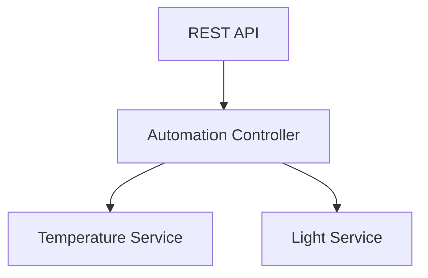

# 🚀 Home Automation System (Yocto | C++ | systemd | REST)

An embedded Linux project demonstrating a **multi-service architecture** built using the Yocto Project.

This project simulates a real-world **IoT / telecom-style system** where independent services communicate through a central controller.

---

## 🧠 Overview

This system is composed of multiple C++ services managed by **systemd**, built with **CMake**, and integrated into a custom **Yocto layer**.

It demonstrates how modern embedded systems are structured in industries like:

* 📡 Telecom (Ericsson, Nokia)
* 🚗 Automotive (AGL, AUTOSAR Linux)
* 🏠 IoT Gateways

---

## 🏗️ System Architecture

```
          +----------------------+
          |      REST API        |
          |  (External Access)   |
          +----------+-----------+
                     |
                     v
          +----------------------+
          |  Automation Controller |
          |   (Decision Engine)   |
          +----------+-----------+
                     |
        +------------+------------+
        |                         |
        v                         v
+----------------+       +----------------+
| Temperature    |       | Light Service  |
| Service        |       | (Actuator)     |
| (Sensor)       |       +----------------+
+----------------+
```

---

## 📊 Architecture Diagram (Visual)



---

## ⚙️ Components

### 🌡️ Temperature Service

* Simulates sensor data
* Logs values using systemd journald

### 💡 Light Service

* Simulates actuator behavior (ON/OFF)
* Controlled by automation logic

### 🧠 Automation Controller

* Central decision-making unit
* Processes data and triggers actions

### 🌐 REST API Server

* Exposes system state via HTTP
* Entry point for external systems

---

## 📂 Project Structure

```
meta-homeautomation/
└── recipes-home/
    ├── temperature-service/
    ├── light-service/
    ├── automation-controller/
    └── rest-api/
```

---

## 🔧 Technologies Used

* 🐧 Yocto Project (Custom Layer Development)
* 💻 C++ (System Programming)
* ⚙️ systemd (Service Management)
* 🔨 CMake (Build System)
* 🌐 Socket Programming (REST API)
* 📜 journald Logging

---

## 🚀 Build Instructions

```bash
git clone <your-repo-url>
cd poky
source oe-init-build-env
bitbake core-image-minimal
```

---

## ▶️ Run in QEMU

```bash
runqemu qemux86-64
```

---

## 🔍 Service Verification

```bash
systemctl status temperature.service
systemctl status light.service
systemctl status automation.service
systemctl status rest.service
```

---

## 🌐 Test REST API

```bash
curl http://localhost:8080
```

---

## 📊 Example Output

```json
{ "temperature": 25, "light": "ON" }
```

---

## 🧪 Logging (Debugging)

```bash
journalctl -u temperature.service
journalctl -u automation.service
journalctl -u light.service
journalctl -u rest.service
```

---

## 🎯 Skills Demonstrated

* Embedded Linux system design
* Yocto layer and recipe development
* Multi-process architecture
* Service orchestration using systemd
* C++ backend service development
* REST API implementation in C++
* Debugging using journald

---

## 🚧 Future Improvements

* 🔄 D-Bus IPC between services
* 📡 Real sensor integration
* 🌍 Web UI dashboard
* 📈 Monitoring & metrics
* 🔐 Security enhancements

---

## 👨‍💻 Author

C++ Developer | Embedded Systems Enthusiast
Focused on building real-world Linux-based systems.

---

⭐ If you find this useful, consider giving it a star!
